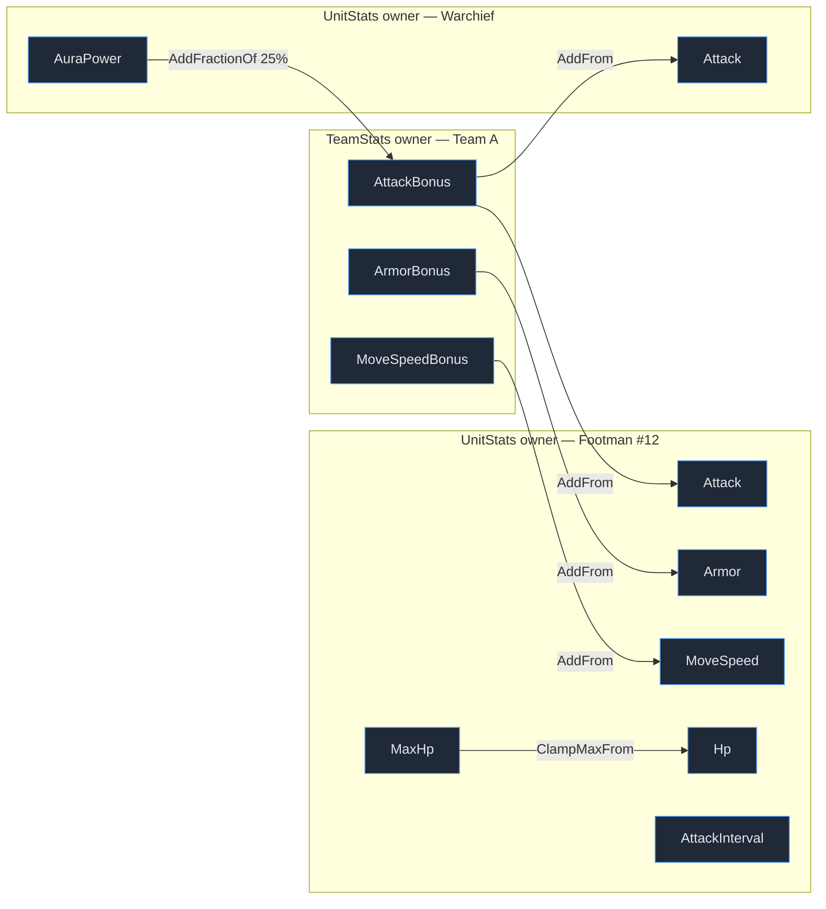

# Sample: RTS Battle — thiết kế

*Doc thiết kế cho sample duy nhất của `ApexionGame.Entities.Stats`. Viết trước khi code, để chốt phạm vi
và kiến trúc. Bản tiếng Anh (`RTS-BATTLE-DESIGN.md`) sẽ viết cùng lúc với implementation.*

Trạng thái: **đề xuất, chờ chốt** · Unity 6000.3.20f1 · URP (Universal Renderer, 3D) · Input System

---

## 1. Mục tiêu

Một **game RTS nhỏ chạy được thật** trong scene Play mode — không phải editor window, không phải
scripted story 16 bước như sample cũ. Bấm Play là đánh nhau ngay.

Hai mục tiêu song song, và cả hai đều phải đạt:

| | |
|---|---|
| **Là một game** | Có UI, có lính, có tướng, có phép, có tài nguyên, có thắng/thua, chơi được bằng chuột |
| **Là một sample** | Mỗi cơ chế gameplay tồn tại vì nó *phơi ra* một tính năng của thư viện stat. Xem mục [§14](#14-ánh-xạ-tính-năng-thư-viện--chỗ-thấy-trong-game) |

Câu hỏi mà sample phải trả lời được trong 30 giây đầu người chơi nhìn màn hình:
**"tại sao tôi cần một dependency-graph stat system thay vì `Dictionary<string, float>`?"**
Câu trả lời trực quan: tướng chết → *cả quân đội* tụt Attack ngay trong frame đó, không ai gọi
recalculate; và panel Inspector cho thấy con số đó được lắp từ đâu.

## 2. Không làm (non-goals)

Cắt thẳng, để sample không phình thành một game thật:

- Không thu tài nguyên trên map, không xây nhà, không cây tech, không fog of war, không pathfinding
  (A*/NavMesh) — lính đi đường thẳng tới mục tiêu gần nhất.
- Không chọn lính bằng khung kéo (drag-select) để ra lệnh di chuyển. Lính **tự** đánh; người chơi
  điều khiển ở tầng *chỉ huy*: spawn, nâng cấp, cast phép. Click lính chỉ để **xem stat**.
- Không art asset (không sprite, không model, không prefab nghệ thuật). Xem [§10](#10-trình-bày-view).
- Không multiplayer, không save/load ở M1–M5 (persistence để dành, xem [§16](#16-milestones)).
- Không audio.

## 3. Luật chơi

Bàn đấu phẳng, camera orthographic nhìn chéo xuống. Hai bên, mỗi bên một **Stronghold** ở hai đầu.

```
   TEAM A (người chơi)                                    TEAM B (AI)
   ┌────────┐                                              ┌────────┐
   │Strong- │  ▲ ▲ ▲  →→→                    ←←←  ▼ ▼ ▼    │ hold   │
   │ hold   │  lính spawn ở đây          lính B tiến sang   │        │
   └────────┘                                              └────────┘
   x = -18                        x = 0                        x = +18
```

1. Mỗi bên có **Supply** tự hồi (+8/s). Supply dùng để spawn lính, mua research, cast phép.
2. Lính spawn cạnh Stronghold của mình, tự tiến sang phía địch.
3. Gặp địch trong tầm đánh → đứng lại, đánh mỗi `AttackInterval` giây. Không còn địch phía trước →
   tiến tiếp và đập Stronghold.
4. **Tướng** (hero) là một unit, nhưng aura của nó buff *toàn quân*. Tướng giết địch thì lên level,
   aura mạnh thêm.
5. **Phép** cast theo vị trí chuột, ảnh hưởng mọi unit trong bán kính — buff cho quân mình hoặc
   debuff quân địch, có thời hạn và cooldown.
6. **Thắng** khi Stronghold địch về 0 HP. Thua thì ngược lại. Có nút Restart.
7. Tốc độ game: Pause / 1× / 2× / 4×.

Ván đấu điển hình dài **2–4 phút** — đủ để thấy research và tướng lên level tạo khác biệt.

## 4. Nội dung game

Tất cả số nằm trong **một** file `RtsContent.cs` để tune một chỗ.

### 4.1 Đơn vị

| Đơn vị | MaxHp | Attack | Armor | MoveSpeed | AttackInterval | Range | Supply | Ghi chú |
|---|---|---|---|---|---|---|---|---|
| Footman | 220 | 14 | 6 | 3.2 | 1.20 | 1.6 | 20 | thịt |
| Archer | 130 | 18 | 2 | 3.6 | 1.50 | 7.0 | 25 | bắn xa, giòn |
| Knight | 340 | 26 | 10 | 4.4 | 1.60 | 1.8 | 45 | đắt, nhanh |
| **Warchief** (hero A) | 900 | 40 | 14 | 3.8 | 1.40 | 2.0 | 120 | aura Attack |
| **Paladin** (hero B) | 1000 | 34 | 18 | 3.6 | 1.50 | 2.0 | 120 | aura Armor |
| Stronghold | 3000 | 0 | 20 | 0 | — | 0 | — | bất động, không đánh |

**Stronghold cũng là một `UnitStats` owner**, chỉ khác bộ số (`MoveSpeed = 0`, `Attack = 0`). Đây là
điều sample muốn nói: *một archetype là một bộ số, không phải một bộ stat mới.* Không có collection
riêng cho nhà, không có nhánh code riêng cho nhà.

### 4.2 Tướng và aura

| Tướng | AuraPower (base) | Đóng góp vào node của team |
|---|---|---|
| Warchief | 60 | `AttackBonus += 25% × AuraPower` → +15 Attack cho *mọi* unit bên mình |
| Paladin | 60 | `ArmorBonus += 20% × AuraPower` (+12) và `MoveSpeedBonus += 2% × AuraPower` (+1.2) |

Tướng giết 3 unit → **level up**: `AuraPower` base **+10**. Một lệnh ghi, cả quân đội đổi Attack.
UI phải làm nổi bật đúng khoảnh khắc này (log + flash panel), vì nó là luận điểm chính của thư viện.

> **Tại sao aura đọc `AuraPower` mà không đọc trực tiếp `Attack` của tướng?**
> Vì tướng cũng là unit: `Attack` của nó *đã* đọc `AttackBonus` của team. Nối thêm chiều
> `AttackBonus ← Attack(tướng)` là đóng vòng, và `TryAddStatModifier` **từ chối tại thời điểm insert**
> (graph luôn là DAG nên propagation không thể treo). `AuraPower` là stat nằm ngoài vùng hạ lưu của
> aura, nên nó phá được vòng. Sample sẽ có nút debug *"thử nối aura vào Attack"* để người đọc **thấy**
> cú từ chối đó thay vì đọc mô tả.

### 4.3 Phép (6 phép, cast theo vị trí chuột)

| Phép | Mục tiêu | Hiệu ứng | Thời hạn | CD | Supply |
|---|---|---|---|---|---|
| Bloodlust | quân mình, r = 5 | `Attack ×1.4`, `AttackInterval ×0.8` | 8s | 16s | 30 |
| Holy Shield | quân mình, r = 5 | `Armor +15` | 8s | 16s | 25 |
| Slow | quân địch, r = 5 | `AttackInterval ×1.5`, `MoveSpeed ×0.6` | 6s | 14s | 25 |
| Weaken | quân địch, r = 5 | `Attack ×0.7` | 6s | 14s | 25 |
| Plague | quân địch, r = 4 | `Armor ×0.8` + **12 dmg mỗi 1s** | 6s | 20s | 35 |
| Rally | quân mình, r = 5 | **+200 Hp ngay** (ghi base value, bị `ClampMax` chặn ở MaxHp) | — | 18s | 30 |

Chọn đúng 6 phép này vì chúng phủ hết mọi hình thái modifier mà một game thật cần: cộng thẳng, nhân
hệ số, nhân nghịch (haste = nhân nhỏ hơn 1), damage-over-time (ghi base value theo nhịp), và một
"phép" không phải modifier gì cả mà chỉ là ghi giá trị + để `ClampMaxFromStat` lo phần chặn trên.

### 4.4 Research (nâng cấp, tối đa 3 cấp mỗi loại)

| Research | Mỗi cấp | Supply cấp 1 / 2 / 3 |
|---|---|---|
| Weapon Smithing | `TeamStats.AttackBonus` base **+3** | 60 / 90 / 130 |
| Plate Armor | `TeamStats.ArmorBonus` base **+2** | 60 / 90 / 130 |
| Boots | `TeamStats.MoveSpeedBonus` base **+0.4** | 45 / 70 / 100 |

Research là **ghi base value của node team**. Aura tướng là **modifier trên cùng node đó**. Hai nguồn
hoàn toàn khác nhau chảy vào một chỗ, và unit không cần biết có bao nhiêu nguồn — kể cả unit spawn
*sau* khi research xong cũng đúng ngay lập tức, miễn phí.

## 5. Mô hình stat

### 5.1 Owner trong store

Một store cho cả ván. Không phải một store mỗi unit, không phải một store mỗi team.



**Mỗi unit tốn đúng 5 modifier, mãi mãi:** 3 link tới node team (Attack/Armor/MoveSpeed), 1 `ClampMax`
cho Hp, 1 `ClampMin` cho AttackInterval. Con số này **không** phụ thuộc quân số, số tướng, hay đã
research bao nhiêu.

Nếu bỏ node team và cho mỗi unit trỏ thẳng tới N tướng: mỗi spawn tốn N modifier, mỗi tướng chết phải
chạm buffer modifier của *mọi* unit. Có node team: spawn tốn hằng số, tướng chết là **một** lần
`TryRemoveStatModifier` rồi tự lan ra. Giá phải trả là graph sâu thêm một tầng.

### 5.2 Khai báo

```csharp
[StatSystem(StatDataSize.Size8, StatUserDataSize.Size2)]
public static partial class RtsStatSystem { }

[StatCollection(typeof(RtsStatSystem), 4100)]
public partial struct TeamStats
{
    [StatData(StatVariantType.Float)] public partial struct AttackBonus { }
    [StatData(StatVariantType.Float)] public partial struct ArmorBonus { }
    [StatData(StatVariantType.Float)] public partial struct MoveSpeedBonus { }
}

[StatCollection(typeof(RtsStatSystem), 4200)]
public partial struct UnitStats
{
    [StatData(StatVariantType.Float)] public partial struct Hp { }
    [StatData(StatVariantType.Float)] public partial struct MaxHp { }
    [StatData(StatVariantType.Float)] public partial struct Attack { }
    [StatData(StatVariantType.Float)] public partial struct Armor { }
    [StatData(StatVariantType.Float)] public partial struct MoveSpeed { }
    [StatData(StatVariantType.Float)] public partial struct AttackInterval { }
    [StatData(StatVariantType.Float)] public partial struct AttackRange { }
    [StatData(StatVariantType.Float)] public partial struct AuraPower { }
}
```

`AttackRange` **cố tình không** có link tới node team — để sample nói được một câu nữa: *không phải
stat nào cũng cần nằm trong graph*. Nó vẫn buff được bằng modifier trực tiếp nếu sau này muốn.

### 5.3 Modifier kinds & thứ tự stack

Sáu kind, giữ nguyên như sample cũ vì bộ này đã đúng và hầu như mọi game đều hội tụ về nó:

| Kind | Dùng ở đâu trong game |
|---|---|
| `Add` | Holy Shield `+15 Armor` |
| `Multiply` | Bloodlust `×1.4 Attack`, Slow `×1.5 AttackInterval` |
| `AddFromStat` | link unit → node team (kind dùng nhiều nhất, áp đảo) |
| `AddFractionOfStat` | aura tướng: node team đọc 25% `AuraPower` |
| `ClampMaxFromStat` | `Hp ≤ MaxHp` |
| `ClampMinConstant` | sàn cho `AttackInterval` |

Thứ tự áp dụng: `current = (base + add) × multiply`, rồi `max`, **rồi** `min` — min sau cùng nên min
thắng khi hai cái chỏi nhau.

> **Sàn `AttackInterval` không phải trang trí.** Vòng đánh là
> `while (cooldown <= 0) { swing(); cooldown += interval; }`. Bloodlust là `×0.8`; stack haste đẩy
> interval về 0 theo hàm hình học, và interval = 0 nghĩa là **vô hạn nhát đánh trong một tick**. Sàn là
> thứ giữ vòng lặp đó kết thúc. Ngược lại, stack slow thì vô hại — chỉ làm unit thành vô dụng.

Contract quan trọng nhất trong toàn bộ file này: `AddObservedStatsToListInternal` phải khai báo **đủ**
stat mà modifier đọc. Thiếu một cái → stat phụ thuộc không bao giờ được recalculate khi input đó đổi:
sai số, không exception, không warning. Sample sẽ drive nó từ property `ObservesAnotherStat` để thêm
kind mới mà quên là không thể.

## 6. Toán chiến đấu

```
mitigation = 100 / (100 + Armor)          // Armor 20 → nhận 83% damage
damage     = Attack × mitigation × (1 ± 0.15)
dps hiển thị = Attack / AttackInterval × mitigation(mục tiêu trung bình)
```

Damage trừ vào **base value** của `Hp` (`TrySetStatBaseValue`), `ClampMaxFromStat` lo phần chặn trên khi
hồi máu. `Hp ≤ 0` → chết ([§9](#9-chết-và-dọn-graph)).

Biến thiên ±15% để log trận đánh không đọc như bảng tính. Random là `Unity.Mathematics.Random` với seed
cố định trong settings.

## 7. Vòng lặp mô phỏng

Fixed timestep **20 Hz** (`0.05s`), accumulator trong `RtsGame.Update`, view nội suy giữa hai tick →
mượt mắt mà logic vẫn rời rạc và test được. Speed 2×/4× = chạy 2/4 tick mỗi lượt (kèm trần số tick/frame
để không tự khoá frame).

Một tick, đúng thứ tự này:

```
1. economy       supply += rate × dt
2. ai            AI director quyết định spawn / research / cast
3. effects       DoT nổ, effect hết hạn → TryRemoveStatModifier
4. movement      chọn mục tiêu, tiến/đứng, đẩy nhau nhẹ để không chồng lên nhau
5. combat        ai hết cooldown thì đánh → ghi Hp base
6. deaths        gom xác, dọn modifier, destroy owner
7. events        đọc worldData change events → view + log, rồi worldData.Clear()
```

`RtsMatch` **không** là `MonoBehaviour` và không tham chiếu `UnityEngine` (ngoài Mathematics/Collections).
Đây không phải sở thích kiến trúc: store là native memory, nên cùng một model chạy được trong EditMode
test không cần scene ([§15](#15-test)).

## 8. Effect có thời hạn

**Thư viện không có khái niệm "thời hạn".** Modifier tồn tại đến khi bị remove. Nên vòng đời thời hạn
nằm ở game — và đó chính là điều sample cần dạy:

```csharp
sealed class ActiveEffect
{
    public RtsSpellDefinition definition;
    public int casterTeam;
    public float remaining;
    public float untilNextTick;                       // chỉ cho DoT
    public readonly List<Applied> applied = new();     // (unitId, StatModifierHandle)
}
```

- **Handle là thứ duy nhất remove được modifier.** Không giữ handle = modifier ở lại đến hết ván.
- **Chính sách stack: refresh, không cộng dồn.** Cast lại cùng một phép lên cùng một unit thì remove
  modifier cũ rồi add lại + reset thời hạn. Chọn refresh vì UI đọc được (một dòng cho mỗi cặp
  effect × unit) và người chơi không spam-stack được. Sàn `ClampMin` vẫn giữ như lưới an toàn — thư viện
  không có quan điểm gì về chuyện này, cả hai cách đều hợp lệ.
- **Remove thất bại là bình thường**, không phải lỗi: unit chết trong lúc buff còn hiệu lực thì modifier
  đã đi theo owner của nó. Đếm số remove thành công và show ra UI (`"Bloodlust hết: trả 14/18 modifier,
  4 cái chết cùng chủ"`) — vì đó là con số duy nhất cho biết bookkeeping của bạn có rò không.

## 9. Chết và dọn graph

```csharp
// 1. remove những modifier unit này SỞ HỮU
foreach (var h in unit.links)     accessor.TryRemoveStatModifier(h, ref worldData);
foreach (var h in unit.auraTerms) accessor.TryRemoveStatModifier(h, ref worldData);  // tướng

// 2. rồi mới destroy owner
accessor.DestroyOwnerAndUpdateObservers(unit.owner, ref worldData);
```

Thứ tự này không phải để cho sạch sẽ. Bỏ bước 1:

- **aura tướng**: term vẫn nằm trên node team, đọc một owner đã chết → tướng chết mà quân đội vẫn giữ
  buff (sai số **thấy được**);
- **link của lính**: để lại observer entry trên node team suốt phần còn lại của ván (rò rỉ **không thấy
  được**, chỉ hiện ra dưới dạng con số tăng dần).

Sample sẽ có toggle debug **"sloppy deaths"** để bật kiểu chết bẩn, cộng một dòng UI đếm observer trên
node team và số modifier dangling — biến cả hai loại lỗi trên thành số trên màn hình, cộng một nút
*Prune* dọn chúng.

Ngoài ra: `ApplyInternal` viết theo hướng *observed stat không còn thì đóng góp 0* và bật cờ trigger
event, để battlefield prune modifier thay vì trả giá lookup thất bại mỗi lần recalculate.

## 10. Trình bày (view)

**Không art asset.** Không sprite, không prefab, không texture import. Lý do: sample phải copy sang
project khác là chạy được, và repo không phải chỗ chứa art tạm.

| Thứ | Cách làm |
|---|---|
| Thân unit | primitive mesh (`Capsule` lính, `Cube` nhà, `Cylinder` dẹt cho tướng + vòng nền) |
| Vật liệu | tạo lúc runtime: `new Material(Shader.Find("Universal Render Pipeline/Unlit"))`, đổi màu theo team, `enableInstancing` |
| Thanh HP | 2 quad con (nền + fill), scale theo `Hp/MaxHp`, xoay cố định về camera |
| Dấu hiệu buff/debuff | quad nhỏ nổi trên đầu, màu theo effect đang có |
| Đòn đánh | đoạn `LineRenderer` nháy 0.1s (Archer bắn thì thấy rõ ai đang đánh ai) |
| Chọn unit | vòng ring quad dưới chân |

Dùng primitive 3D + URP/Unlit chứ không dùng SpriteRenderer, vì project đang cấu hình **Universal
Renderer (3D)** — `Settings/URP-*-Renderer.asset` có SSAO, không phải 2D Renderer. Sprite trong đường
render đó là rủi ro material hồng không đáng nhận cho một sample.

Camera: orthographic, nghiêng ~50°, thấy vừa đủ cả bàn đấu; pan (kéo chuột phải / WASD) và zoom (wheel)
để soi cụm giao tranh.

View là **pool**, không create/destroy `GameObject` mỗi lần lính chết.

## 11. UI

UI Toolkit runtime (`UIDocument` + `PanelSettings` + UXML/USS trong `Rts/View/Ui/`), theme
`UnityDefaultRuntimeTheme`. Chọn UI Toolkit vì cả project đang đi theo hướng đó, và vì panel Inspector là
một bảng dữ liệu — thứ UI Toolkit làm tốt hơn UGUI nhiều.

```
┌──────────────────────────────────────────────────────────────────────────────┐
│ 01:23   ‖ ▶ 1× 2× 4×      A ■■■■■■ 18 units ⚔ 12 units ■■■■ B      Restart   │
├──────────────┬───────────────────────────────────────────┬───────────────────┤
│ TEAM A       │                                           │ INSPECTOR        │
│ Supply  128  │                                           │ Warchief #7  ♦A  │
│              │                                           │                  │
│ ── SPAWN ──  │            ▲ ▲   ▲                        │ Attack           │
│ Footman  20  │          ▲ ♦ ▲ ▲     ▼ ▼                  │   base    40.0   │
│ Archer   25  │            ▲ ▲     ▼ ▼ ♦ ▼                │   current 63.0   │
│ Knight   45  │                                           │   ▸ +15 AddFrom  │
│ Warchief 120 │                                           │     TeamA/Attack │
│              │                                           │     Bonus        │
│ ── RESEARCH ─│                                           │   ▸ ×1.4 Multiply│
│ Weapons ●●○  │                                           │     Bloodlust    │
│ Plate   ●○○  │                                           │                  │
│ Boots   ○○○  │                                           │ Hp   712 / 900   │
│              │                                           │ AttackInterval   │
│ Stronghold   │                                           │   1.40 → 1.12    │
│ ████████ 82% │                                           │ AuraPower  70.0  │
├──────────────┴───────────────────────────────────────────┴───────────────────┤
│ [Bloodlust] [Holy Shield] [Slow 6s] [Weaken] [Plague] [Rally]     ● GRAPH    │
├──────────────────────────────────────────────────────────────────────────────┤
│ 01:20  Warchief lên level 2 — AuraPower 60 → 70, 1 lệnh ghi, 41 stat đổi     │
│ 01:18  Bloodlust hết hiệu lực: trả 14/18 modifier (4 chết cùng chủ)          │
└──────────────────────────────────────────────────────────────────────────────┘
```

Đặc tả từng vùng:

| Vùng | Nội dung | Phơi ra tính năng gì |
|---|---|---|
| Top bar | thời gian, pause/tốc độ, quân số + HP Stronghold hai bên, Restart | — |
| Panel trái | Supply, nút spawn (disable khi thiếu supply), research 3 cấp, HP nhà | ghi base value node team |
| **Inspector** | click unit → **base vs current** của từng stat, và **danh sách modifier kèm nguồn** | cả graph, hiện thành bảng |
| Spell bar | 6 nút, vòng cooldown, giá supply; bấm rồi click bàn đấu để chọn tâm AoE | modifier có thời hạn |
| Nút GRAPH | overlay: vẽ đường từ node team tới từng unit + số observer, số modifier dangling, số stat recalculate ở lệnh ghi vừa rồi | quan sát propagation |
| Log | 8 dòng cuối, tô màu theo loại sự kiện | kể chuyện đang xảy ra |

Panel Inspector là ngôi sao. Nó không có sẵn: thư viện **không lưu tên** cho modifier, nên game phải tự
giữ `Dictionary<StatModifierHandle, string>` mô tả nguồn (`"TeamA/AttackBonus"`, `"Bloodlust"`,
`"aura Warchief #7"`). Doc và README phải nói rõ đây là việc của game — người đọc sample sẽ cần đúng thứ
này trong project của họ.

## 12. Điều khiển

Project đặt `activeInputHandler: 1` — **chỉ Input System package**, `UnityEngine.Input` cũ không hoạt
động. Nên asmdef phải thêm `Unity.InputSystem`, và code đọc `Mouse.current` / `Keyboard.current` trực
tiếp (không cần asset InputActions cho 6 phím).

| Input | Hành động |
|---|---|
| Chuột trái lên unit | chọn để xem Inspector |
| Chuột trái lên bàn đấu (khi đang chọn phép) | cast tại đó |
| `1`–`6` | chọn phép |
| `Q W E` | spawn Footman / Archer / Knight |
| Chuột phải kéo, hoặc WASD | pan camera |
| Wheel | zoom |
| `Space` | pause/resume · `1`..`4` khi giữ `Ctrl`: tốc độ |
| `Esc` | bỏ chọn phép |

## 13. Kiến trúc file

Ba tầng, phụ thuộc một chiều: `View → Sim → Content → Stats`.

```
ApexionGame.Entities.Stats.Samples/
├── ApexionGame.Entities.Stats.Samples.asmdef      + Unity.InputSystem
├── README.md · README.vi.md                        (viết ở M5)
├── rts-battle.unity                                scene duy nhất
└── Rts/
    ├── RtsStatSystem.cs          [StatSystem], StatModifier, Stack  (§5.3)
    ├── RtsStats.cs               TeamStats + UnitStats              (§5.2)
    ├── Content/
    │   ├── RtsUnitArchetype.cs
    │   ├── RtsSpellDefinition.cs
    │   ├── RtsResearchDefinition.cs
    │   └── RtsContent.cs         toàn bộ số của §4, một chỗ
    ├── Sim/                      không tham chiếu UnityEngine
    │   ├── RtsMatchSettings.cs
    │   ├── RtsMatch.cs           lifetime store/worldData, team, spawn, tick
    │   ├── RtsMatch.Combat.cs    target, di chuyển, nhát đánh, damage
    │   ├── RtsMatch.Effects.cs   cast, thời hạn, DoT, hết hạn (§8)
    │   ├── RtsMatch.Economy.cs   supply, giá spawn/research/spell
    │   ├── RtsMatch.Diagnostics.cs  đếm observer/dangling, prune (§9)
    │   ├── RtsUnit.cs            owner, handles, links, pos, cooldown, alive
    │   ├── RtsTeam.cs            node team, danh sách unit, research đã mua
    │   ├── RtsAiDirector.cs      AI bên B (và auto-play tuỳ chọn cho bên A)
    │   ├── RtsStatSnapshot.cs    dữ liệu cho Inspector: base/current + nguồn modifier
    │   └── RtsMatchLog.cs        ring buffer dòng log
    ├── View/
    │   ├── RtsGame.cs            MonoBehaviour duy nhất trong scene: bootstrap + accumulator
    │   ├── RtsPrimitives.cs      mesh/material runtime
    │   ├── RtsUnitView.cs · RtsUnitViewPool.cs
    │   ├── RtsCameraRig.cs
    │   ├── RtsInput.cs
    │   ├── RtsHud.cs             bind UXML, cập nhật mỗi frame
    │   ├── RtsInspectorPanel.cs · RtsSpellBar.cs · RtsGraphOverlay.cs
    │   └── Ui/
    │       ├── RtsHud.uxml · RtsHud.uss
    │       └── RtsPanelSettings.asset
    └── Tests/
        ├── ApexionGame.Entities.Stats.Samples.Tests.asmdef   (EditMode)
        └── RtsMatchTests.cs
```

Scene chỉ chứa: Camera, một GameObject `RtsGame`, một `UIDocument`. Mọi thứ khác do code dựng — scene
tối giản thì diff đọc được và không ai vô tình phá bằng cách kéo thả.

## 14. Ánh xạ: tính năng thư viện ↔ chỗ thấy trong game

Bảng này là hợp đồng của sample. Mỗi dòng phải quan sát được **trong Play mode**, không cần đọc code:

| Tính năng | Thấy ở đâu |
|---|---|
| Cross-owner dependency | Inspector của lính: `Attack ▸ +15 AddFrom TeamA/AttackBonus` |
| Ghi một chỗ, lan cả graph | tướng lên level: 1 lệnh ghi, log báo "41 stat đổi" |
| Modifier stack | Inspector: base 40 → current 63 với danh sách 2 modifier |
| Từ chối cycle | nút "thử nối aura vào Attack" → log báo bị từ chối, không có gì thay đổi |
| `ClampMaxFromStat` | Rally hồi 200 Hp nhưng dừng đúng ở MaxHp |
| `ClampMinConstant` | stack Bloodlust: AttackInterval tụt tới sàn rồi dừng |
| Modifier có thời hạn (việc của game) | spell bar cooldown + dòng log "trả 14/18 modifier" |
| Destroy owner + observer | tướng chết → toàn quân tụt Attack ngay trong tick đó |
| Rò observer nếu dọn sai | toggle *sloppy deaths* + overlay GRAPH đếm số dangling, nút Prune |
| `StatChangeEvent` | thanh HP và Inspector chỉ vẽ lại theo event, không poll |
| Nhiều event cho một stat trong một propagation | overlay GRAPH show `events` vs `stat đổi thật` |
| `produceChangeEvents` per-stat | `AuraPower` bật, `AttackRange` tắt — và giải thích tại sao |
| Batch write | spawn một wave dùng `TrySetBaseValueToStats` một lần |
| Stat Debugger (Editor) | *ApexionGame ▸ Stats ▸ Stat Debugger* mở được giữa trận, đăng ký qua `StatDebugRegistry` |

## 15. Test

`RtsMatchTests.cs`, EditMode, drive `RtsMatch` không cần scene — đây là lý do tầng Sim phải sạch
`MonoBehaviour`:

1. **Bất biến 5 modifier**: spawn 30 unit → `TryGetModifierCount` cho từng unit đúng 5, bất kể research
   hay số tướng.
2. **Chết sạch không rò**: spawn 40, giết hết, số observer trên node team về đúng mức ban đầu.
3. **Chết bẩn thì rò** (test khẳng định điều ngược lại thật sự xảy ra — nếu không thì cảnh báo trong
   README là vô nghĩa).
4. **Effect hết hạn trả hết modifier** cho unit còn sống, và không throw với unit đã chết.
5. **Tướng lên level lan tới unit spawn sau**: level up trước, spawn sau, Attack của unit mới vẫn đúng.
6. **Aura vòng bị từ chối** và store không đổi (đếm modifier trước/sau).
7. **Determinism**: cùng seed + cùng chuỗi lệnh → cùng kết quả sau 2000 tick.
8. **Ván đấu kết thúc**: chạy tới khi có bên thắng trong ≤ 6000 tick, không exception, `Dispose` sạch.

Chạy: `unity test . --mode EditMode --filter "ApexionGame.Entities.Stats.Samples.Tests"`

## 16. Milestones

Mỗi mốc phải **chạy được**, không có mốc nào chỉ là scaffolding chết.

| M | Nội dung | Nghiệm thu |
|---|---|---|
| **M0** | asmdef + scene + `RtsGame` + primitive/material + camera | Play: 1 lính hiện ra và đi sang phải |
| **M1** | Sim core: store/team node/spawn/target/di chuyển/đánh/chết, tướng + aura | Play: hai bên tự đánh tới khi một bên hết lính; log ra text |
| **M2** | Effect: 6 phép, thời hạn, DoT, hết hạn, dọn khi chết, prune | Cast được từ code/nút tạm; test 1–4 xanh |
| **M3** | UI: top bar, panel team, spell bar, **Inspector**, log | Chơi được bằng chuột, Inspector đúng số |
| **M4** | Economy + AI director + thắng/thua + restart + tốc độ | Ván đấu trọn vẹn có kết quả; test 5–8 xanh |
| **M5** | Polish: nội suy view, thanh HP, đòn đánh, overlay GRAPH, README EN + VI, CHANGELOG | Sample đọc được như tài liệu |

Tuỳ chọn sau M5, nếu thấy đáng: **M6 — persistence.** Nút Save/Load giữa trận, dùng snapshot owner +
pass remap handle. Đây là tính năng thư viện có mà sample chưa dùng, và cái bẫy của nó rất thật: gần
như mọi modifier đều trỏ tới node team, remap sai một cái là cả quân đội đọc bonus của địch. Không đưa
vào M1–M5 vì nó không làm game hay hơn, chỉ làm sample đầy hơn.

## 17. Quyết định kỹ thuật đã chốt (và vì sao)

| Quyết định | Vì sao |
|---|---|
| Primitive 3D + URP/Unlit, không sprite | project dùng Universal Renderer 3D (renderer asset có SSAO); sprite dễ ra material hồng |
| Không art asset nào | sample copy đi đâu cũng chạy |
| Input System package trực tiếp (`Mouse.current`) | `activeInputHandler: 1`, Input cũ tắt; 6 phím không cần asset InputActions |
| UI Toolkit runtime | project đi theo hướng này; Inspector là bảng dữ liệu |
| Tầng Sim không có `MonoBehaviour` | EditMode test không cần scene; store là native memory |
| Fixed 20 Hz + nội suy view | logic rời rạc test được, hình vẫn mượt |
| Một store cho cả ván | chỉ collection cùng một system mới nối modifier được với nhau |
| Effect refresh (không stack cộng dồn) | UI đọc được, không spam-stack; vẫn giữ `ClampMin` làm lưới an toàn |
| Stronghold dùng `UnitStats` | archetype là bộ số, không phải bộ stat mới |

## 18. Cần chốt

Bốn điểm tôi có ý kiến nhưng là quyết định của bạn. Nếu bạn chỉ trả lời "ok" thì tôi làm theo đề xuất:

1. **Supply/economy** — *đề xuất: giữ.* Không có nó thì người chơi chỉ có nút spawn vô hạn, không còn
   quyết định gì. Nếu bạn muốn cắt cho gọn, cắt được sạch trong M4 mà không ảnh hưởng phần stat.
2. **AI cho bên B** — *đề xuất: có, cộng thêm nút auto-play cho bên A*, để bấm Play là xem được ngay
   mà không cần biết luật.
3. **Ngôn ngữ code comment + README** — *đề xuất: tiếng Anh, kèm `README.vi.md`*, đúng convention của
   package `ApexionGame.Entities.Stats` hiện tại. Doc thiết kế (file này) giữ tiếng Việt.
4. **Số lượng phép: 6** — *đề xuất: giữ 6*, vì đúng 6 phép này mới phủ hết các hình thái modifier ở
   [§4.3](#43-phép-6-phép-cast-theo-vị-trí-chuột). Cắt xuống 4 thì mất DoT hoặc mất demo `ClampMax`.

Ngoài ra, một câu hỏi phạm vi lớn hơn: sample này **thay thế hoàn toàn** sample cũ
(`stats-playground`, `battle`, editor window) hay bạn muốn giữ lại một playground nhỏ để test nhanh
từng tính năng? *Đề xuất: thay thế hoàn toàn* — một sample chạy được thật đáng giá hơn ba sample
demo rời rạc, và bảng [§14](#14-ánh-xạ-tính-năng-thư-viện--chỗ-thấy-trong-game) đã phủ hết những gì
playground từng phủ.

---

## 19. Sai lệch khi implement (2026-08-05)

Doc trên là bản thiết kế trước khi code. Dưới đây là những chỗ **bản code khác doc**, và vì sao —
đọc mục này trước khi lấy doc làm chuẩn.

| Chỗ | Doc nói | Code làm | Vì sao |
|---|---|---|---|
| UI | UXML + USS + PanelSettings trong `Rts/View/Ui/` | **UI Toolkit dựng bằng C#** với inline style; chỉ còn `RtsPanelSettings.asset` | fileID của asset UXML sinh theo nội dung, nên scene **viết tay** không tham chiếu tới nó một cách chắc chắn được. Scene viết tay là điều kiện để scene đọc được trong diff, nên UXML là thứ phải nhường |
| Destroy owner | `accessor.DestroyOwnerAndUpdateObservers` | `store.DestroyOwner` | method đó chỉ có trên generic `StatAccessor<6>`; facade `RtsStatSystem.Accessor` được generate ra **không** bọc nó. Với đường chết sạch thì cũng không cần: các remove phía trước đã recalculate xong mọi thứ phụ thuộc |
| `produceChangeEvents` | bật per-stat, tắt cho `AttackRange` | bật cho tất cả (`CreateAllStats(produceChangeEvents: true)`) | tránh đoán signature của `TrySetProduceChangeEventsFor*`. `AttackRange` vẫn giữ vai trò "stat không có link tới node team" như doc muốn |
| Pan camera | WASD | **phím mũi tên** + kéo chuột phải | W/E/R đã là phím spawn, đụng nhau |
| Chết | chỉ xảy ra trong combat | thêm API `KillUnits` + nút HUD **`kill 5 of mine`** | cần một cách *bấm là thấy* để so sánh chết sạch vs chết bẩn, không phải ngồi đợi trận đánh sinh ra tình huống |
| Lên level tướng | nút bấm | tự lên theo số mạng (3 mạng/level) **và** nút `hero +1` | tự lên mới thành gameplay; nút vẫn giữ để demo propagation theo yêu cầu |
| Test | 8 test | **13 test** | tách nhỏ hơn: thêm heal-vượt-MaxHp, recast-refresh-không-stack, DoT, aura tới unit spawn sau, tướng chết mất aura. Bỏ test "sàn ClampMin sống sót khi stack haste" vì với chính sách refresh thì nó không stack được — test đó không kiểm được điều nó nói |
| Milestone | M0…M5 tuần tự | làm gọn trong một lượt: M0–M4 xong, M5 xong phần nội suy/thanh máu/log/overlay số | phần cắt của M5: không có damage popup, không có `LineRenderer` cho đòn đánh (thay bằng lunge + flash trắng) |

**Trạng thái build:** cả `ApexionGame.Entities.Stats.Samples` và
`ApexionGame.Entities.Stats.Samples.Tests` compile sạch (0 error, 0 warning) — kiểm bằng cả
`dotnet build` lẫn chính vòng compile của Unity Editor đang mở.

**Trạng thái test:** **13/13 pass**, chạy batch mode trên Unity 6000.3.20f1 ngày 2026-08-05
(`total="13" passed="13" failed="0"`, 0.27s).

```powershell
# lưu ý: KHÔNG dùng -quit chung với -runTests, Editor sẽ thoát trước khi test kịp chạy
& "C:\Program Files\Unity\Hub\Editor\6000.3.20f1\Editor\Unity.exe" -batchmode `
  -projectPath . -runTests -testPlatform EditMode `
  -testFilter "ApexionGame.Entities.Stats.Samples.Tests" -testResults rts-tests.xml
```

Trong lần chạy đó, test `AnUnansweredArmyEndsTheMatch` cầm cả một ván đấu tới lúc có người thắng chỉ
trong **31 ms** wall-clock (hơn 30 giây thời gian mô phỏng, hơn 4000 tick) — con số nhanh tới mức đáng
nghi, nên test có thêm ba assert chống "thắng vì lý do sai": thời gian mô phỏng > 30s, bên B phải spawn
> 10 unit, bên A phải mất > 5 unit.

---

## 20. Refactor v2 — cấu trúc project (2026-08-05, cùng ngày)

Bản implement đầu tiên **chạy đúng nhưng cấu trúc xấu**: `RtsMatch` phình thành ~2000 dòng / 82 public
member trong 7 file partial; `RtsHud` 764 dòng làm cả build lẫn refresh 6 panel; entity mô phỏng mang
state của view; content là class field mutable; và vài chỗ API mở public chỉ để test chọc vào. Mục này
ghi lại bản refactor.

### 20.1 Hai assembly, layering do compiler giữ

```
Rts.Core/   ApexionGame.Entities.Stats.Samples.Rts.Core    ← game
Rts.Game/   ApexionGame.Entities.Stats.Samples.Rts.Game    ← trình bày (biết Core)
Rts.Tests/  ApexionGame.Entities.Stats.Samples.Rts.Tests   ← 20 test EditMode
```

`Rts.Core` **không** tham chiếu `Rts.Game`, nên không có đường nào để presentation lọt vào mô phỏng, và
`RtsLayeringTests` chốt thêm hai điều: không type nào trong Core kế thừa `UnityEngine.Object`, và Core
không reference assembly Game.

**`noEngineReferences: true` là bất khả thi** — đã thử và compiler bác bỏ dứt khoát: code do generator
sinh ra cần `UnityEngine.HideInCallstack`, còn `Allocator` và `NativeArray<T>` **nằm trong
UnityEngine.CoreModule** chứ không nằm trong package Unity.Collections. Nghĩa là bất kỳ assembly nào chạm
native collection đều tham chiếu engine, dù muốn hay không. Câu "sim thuần, test không cần scene" vẫn
đúng và vẫn được test chứng minh — chỉ là nó không thể được enforce bằng flag đó.

### 20.2 Phần nào ra phần đó

| Trước | Sau |
|---|---|
| `RtsMatch` 7 file partial, ~2000 dòng, giữ store + spawn + combat + effect + economy + AI + diagnostics + format chuỗi | `RtsMatch` ~250 dòng giữ **đúng hai thứ**: ai tồn tại, và thứ tự mọi việc xảy ra |
| plumbing store rải khắp 7 file | **`RtsStatWorld`** — type duy nhất chạm store/accessor/worldData, kể cả thứ tự Dispose |
| mọi cơ chế lẫn nhau | 6 system, mỗi file một cơ chế: spawn, movement, combat, effect, economy, death |
| `RtsUnit` mang `swingFlash`, `hitFlash`, `buffCount`, `debuffCount` | model chỉ còn state mô phỏng; view tự giữ timer, ăn `RtsBattleFeed` (sự kiện swing/hit/death) |
| log là chuỗi nội suy ngay trong sim | `RtsJournal` lưu **dữ liệu** (`RtsJournalEntry`), `RtsJournalText` bên Game lo câu chữ/số nhiều |
| lý do từ chối lệnh là `out string reason` | enum `RtsRejection`, `RtsRejectionText` bên Game dịch ra tiếng người |
| `RtsHud` 764 dòng | `RtsHudTheme` + `RtsWidgets` + 6 class panel + `RtsHud` chỉ còn layout; panel nhận `IRtsHudHost` nên không biết MonoBehaviour |
| `RtsGame` 434 dòng (loop + input + selection + 15 command) | `RtsGame` ~190 dòng nối dây; `RtsMatchLoop` (accumulator/nội suy) và `RtsPlayerController` (mọi động từ) tách riêng |
| enum `RtsUnitStat`/`RtsTeamStat` viết tay trùng generated | dùng `UnitStats.Type`/`TeamStats.Type`; `RtsStatRef` là **switch duy nhất** trong project |
| content class field mutable | `sealed record` / `readonly record struct` bất biến, `RtsContent` trả `IReadOnlyList`, có test chặn public field mutable |
| `List`/`Dictionary`/`HashSet` | `FasterList<T>`, `ArrayMap<K,V>`, `ArraySetNative<T>` (EncosyTower) — drain event + lọc trùng + set dangling không cấp phát |
| `KillUnits` + `SetSloppyDeaths` mở cho test | `RtsGraphExperiments` — cull / sloppy / cycle / prune / recalc là **tính năng của sample**, gắn nút HUD; test dùng đúng API đó |
| test chọc `team.spellCooldowns[0] = 0f` | test đợi hết cooldown qua thời gian mô phỏng; `RtsTeam` chỉ mở `CooldownOf`/`StartCooldown`/`AdvanceCooldowns` |
| 1 file test 13 case | 4 file: graph invariant · effect · match flow · layering, tổng 20 case |

Học từ code sample của EncosyTower (`Samples~/EncosyTower.Samples.Stats`): file nhỏ một việc, tách
assembly **Definitions/Systems**, `readonly record struct` cho message, và event tách sim ↔ HUD.

### 20.3 Trạng thái

`Rts.Core`, `Rts.Game`, `Rts.Tests` compile sạch (0 error, 0 warning) qua Roslyn + generator thật. Bộ 20
test chưa chạy lại sau refactor vì Unity đang mở và reimport lại `Library`; lệnh chạy nằm ở
[§19](#19-sai-lệch-khi-implement-2026-08-05).
